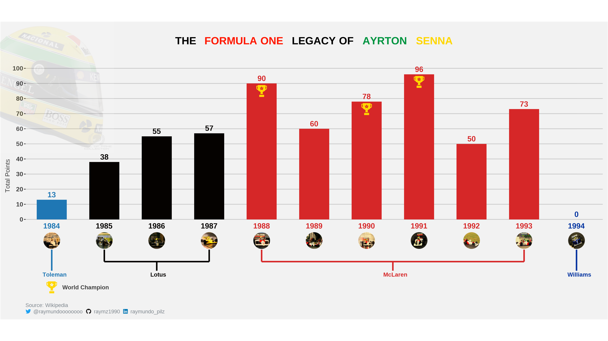
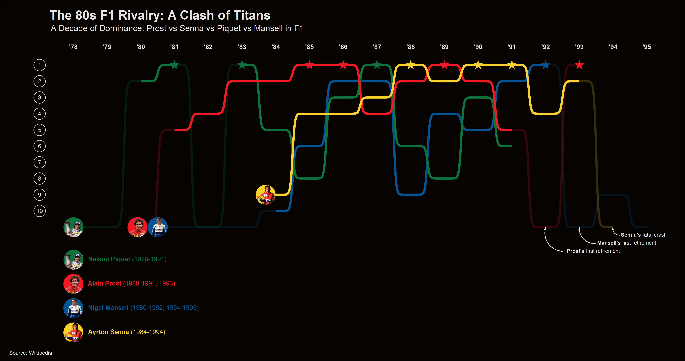
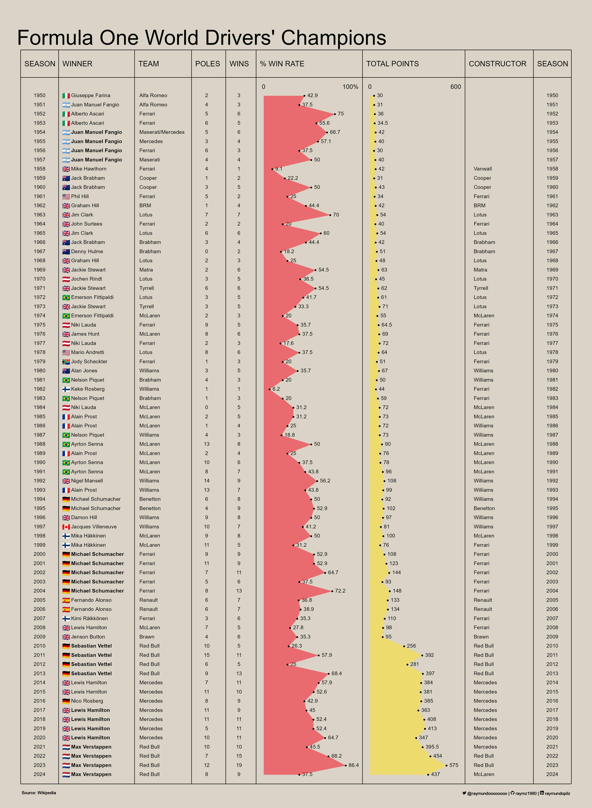

# Personal Data Visualization Projects

This repository is dedicated to sharing my journey in exploring *data visualization* and analysis with `R`.

The directories will include datasets and code files. Code files will include comments to walk through different steps of generating the visualiztion.

---

## **Summary**

| **Month** | **Topic**                               | **Main Packages**               | **Source**      |
|:---------:|:----------------------------------------|:--------------------------------|:----------------|
| 01        | [Formula One](./2024/month-01)          | ggplot, ggtext, ggimage, ggbump | Wikipedia       |

---

## **Projects**

### **[P01 - The Formula One Legacy of Ayrton Senna](./2024/month-01/p01-senna_carrer)**
Inspired by Tanya Shapiro's [Leo's Girlfriend Chart](https://github.com/tashapiro/tanya-data-viz/blob/main/dicaprio-gfs/dicaprio-gfs.R), this visualization explores Ayrton Senna's career in Formula One. Each car image represents the corresponding season.

The plot was created using `ggplot`, `ggtext`, and `ggimage`.

---

### **[P02 - The 80s F1 Rivalry](./2024/month-01/p02-senna_prost_mansell_piquet)**
This visualization explores the instense rivalry between four of the greatest Formula 1 drivers of the 80s:

- **Alain Prost** (4-time World Champion)
- **Ayrton Senna** (3-time World Champion)
- **Nelson Piquet** (3-time World Champion)
- **Nigel Mansell** (1-time World Champion)

Inspired by [David Sjoberg](https://github.com/davidsjoberg/ggbump) and his `ggbump` charts examples, this projects analyse the performance trends of these legendary drivers across multiple seasons.

The plot was created using `ggplot`, `ggbump` and `ggimage`.

---

### **[P03 - Formula One World Drivers' Champions](./2024/month-01/p03-drivers_champions)**

This visualization explores all Formula 1 World Champions by season, from the first championship in 1950 to the present.

Inspired by [Georgios Karamanis](https://github.com/gkaramanis/tidytuesday/blob/master/2020/2020-week15/plots/tour-de-france.png) `tidytuesday` challenge, this visualization represents the evolution of champions throughout F1 history.
The plot was created using `ggplot`, `ggtext` and `ggimage`.

---